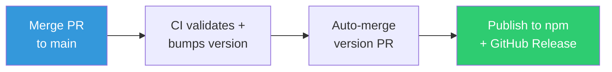

# Contributing to MAD Skills

Thanks for your interest in contributing! This guide covers how to add skills, fix bugs, and get changes merged.

## Quick Start

```bash
git clone https://github.com/slamb2k/mad-skills.git
cd mad-skills
npm install
npm test    # validate + lint + eval
```

No build step needed for development — scripts run directly with Node.js (>=18).

## Adding a New Skill

### 1. Create the skill directory

```
skills/<name>/
├── SKILL.md              # Required: frontmatter + banner + execution logic
├── references/           # Large prompts, templates, guides (loaded on demand)
├── assets/               # Static files (templates, components)
└── tests/
    └── evals.json        # Required: eval test cases
```

### 2. Write SKILL.md

Every SKILL.md follows the same structure:

**Frontmatter** (required fields):

```yaml
---
name: my-skill
description: >-
  What the skill does and when to use it. Be specific about triggers —
  include both what it does AND contexts for when Claude should invoke it.
argument-hint: "--flag1, --flag2"    # Optional
allowed-tools: Bash, Read, Write, Edit, Glob, Grep, AskUserQuestion
---
```

**Banner** (required): ASCII art using `██╗` block characters with the `/name` prefix pattern. Include 6-8 themed taglines. See any existing skill for the exact format.

**Body**: Full orchestration logic. Keep under 500 lines — move large prompts and templates to `references/`.

### 3. Write evals

Create `tests/evals.json` with 3-4 test cases:

```json
[
  {
    "name": "banner-display",
    "prompt": "/my-skill",
    "assertions": [
      { "type": "contains", "value": "██" },
      { "type": "regex", "value": "emoji1|emoji2" },
      { "type": "semantic", "value": "Displays a banner before doing anything else" }
    ]
  }
]
```

Assertion types:
- `contains` — literal string match
- `regex` — pattern match with optional `flags`
- `semantic` — LLM-evaluated natural language (use for behavior, not exact text)

### 4. Validate

```bash
npm run validate    # Structure checks
npm run lint        # SKILL.md format
npm run eval        # Run assertions (needs ANTHROPIC_API_KEY or OPENROUTER_API_KEY)
```

## Skill Conventions

### Banner Pattern

Every skill outputs an ASCII art banner **immediately** on invocation, before any other output. The first line of ASCII art uses a Braille space character (`⠀`) followed by 3 regular spaces. Pick one random tagline per invocation.

### References Pattern

Large prompts live in `references/` and are loaded by the orchestration logic in SKILL.md:

```markdown
Launch subagent:
  prompt: <read from references/stage-prompts.md#stage-2>
```

Reference files use markdown headings as section delimiters. Each section is a self-contained prompt with structured output format and template variables.

### Subagent Pattern

Heavy work runs in isolated subagents to keep the primary context clean:

```markdown
Task(
  subagent_type: "Explore",
  description: "Scan the codebase",
  prompt: <read from references/...>
)
```

Prefer deterministic scripts over LLM subagents for stages that are pure
CLI commands. Use the lightest approach that can do the job:
- **Bash scripts** (`scripts/`) — git operations, CI polling, merges, any deterministic workflow
- **Explore** — codebase scanning, file pattern searches
- **general-purpose** — complex analysis, code fixes, commit/PR authoring

### Report Pattern

All subagent outputs follow a structured format with line limits:

```
REPORT_NAME:
- field1: value
- field2: value
- status: success|failed
```

### Idempotency

Skills that generate files should be safe to run multiple times:
- Skip already-done work
- Update existing files rather than overwriting
- Ask before replacing user customizations

### Pre-flight Checks

Skills with external dependencies use a pre-flight table:

```markdown
| Dependency | Type | Check | Required | Resolution | Detail |
|-----------|------|-------|----------|------------|--------|
| git | cli | `git --version` | yes | stop | Install from... |
```

## Making Changes

### Commit Convention

Use [Conventional Commits](https://www.conventionalcommits.org/) with scope:

```
feat(dock): add Azure Container Apps deployment
fix(ship): handle merge conflicts in CI watch
refactor(hooks): extract banner into separate module
docs(readme): update walkthrough for new skills
chore(release): bump version to 2.0.15
```

### Branch Strategy

1. Create a feature branch from `main`
2. Make changes, validate, lint
3. Open a PR — CI runs automatically
4. Squash merge when checks pass

Or just use `/ship` — it handles all of this.

### Release Process

Fully automated — no manual steps:



Every merge to `main` triggers:
1. Validate + lint + evals
2. Patch version bump → auto-merge PR
3. npm publish with provenance
4. `.skill` packages → GitHub Release

## Project Layout

```
mad-skills/
├── skills/          # 10 skill definitions
├── scripts/         # Build and CI tooling
├── hooks/           # Session guard (Node.js)
├── agents/          # Agent definitions (reserved)
├── tests/results/   # Eval output
├── archive/         # Legacy skills (inactive)
├── .claude-plugin/  # Plugin metadata
└── .github/         # CI workflow
```

## Code of Conduct

Be kind, be constructive. Focus on the work.
