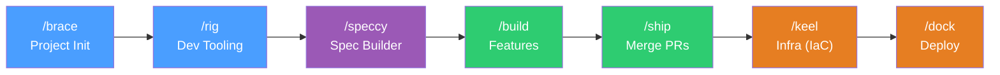
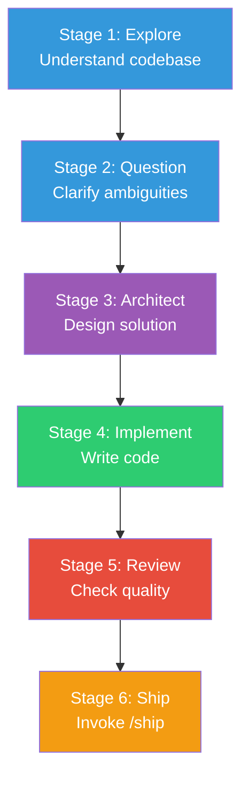
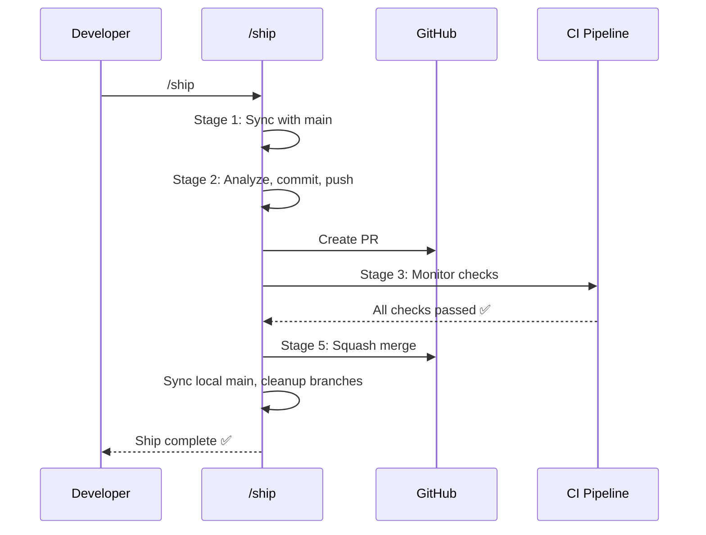
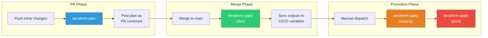
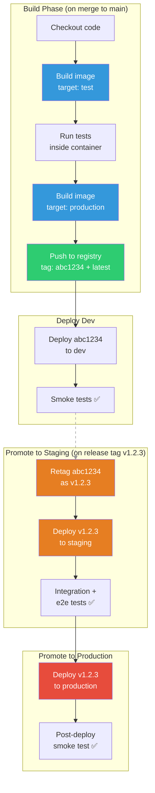
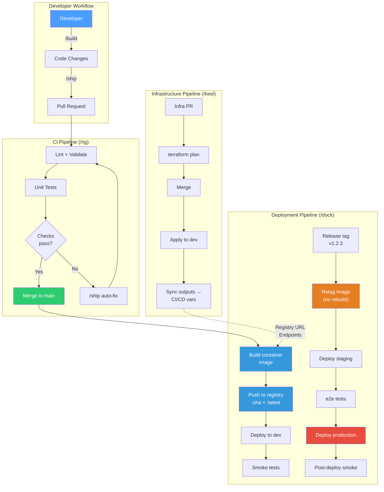

# MAD Skills


A skill framework for Claude Code. Ships 10 skills covering the full development lifecycle — from project initialization to shipping PRs.

## Skills

| Skill | Command | Description |
|-------|---------|-------------|
| **build** | `/build` | Context-isolated feature development pipeline. Takes a design/plan and executes explore, question, architect, implement, review, ship inside subagents. |
| **brace** | `/brace` | Initialize projects with a standard scaffold. Creates specs/, tools/, context/ directories, project CLAUDE.md, and branch protection. |
| **distil** | `/distil` | Generate multiple unique web design variations. Creates a Vite + React + TypeScript + Tailwind project with N designs at /1, /2, /3. |
| **dock** | `/dock` | Generate container release pipelines. Builds once, promotes immutable images through dev → staging → prod. Supports Azure Container Apps, AWS Fargate, Cloud Run, Kubernetes, Dokku, Coolify, CapRover. |
| **keel** | `/keel` | Generate IaC pipelines (Terraform, Bicep, Pulumi, CDK) to provision cloud infrastructure. Plans on PR, applies on merge. Provisions what /dock deploys to. |
| **prime** | `/prime` | Load project context before feature work. Supports domain-specific context (security, routing, dashboard, etc.). |
| **rig** | `/rig` | Bootstrap repos with lefthook hooks, commit templates, PR templates, and GitHub Actions workflows. Idempotent. |
| **ship** | `/ship` | Full PR lifecycle — sync with main, create branch, commit, push, create PR, wait for CI, fix issues, squash merge, cleanup. |
| **speccy** | `/speccy` | Interview-driven specification builder. Reviews code/docs, interviews through targeted questions, produces structured specs. |
| **sync** | `/sync` | Sync local repo with origin/main. Stashes changes, pulls, restores stash, cleans up stale branches. |

## Lifecycle Overview

The 10 skills form a complete development-to-deployment pipeline. Each skill produces artifacts that downstream skills consume.



| Phase | Skills | What happens |
|-------|--------|--------------|
| **Setup** | `/brace` → `/rig` | Initialize project structure, install hooks, templates, CI workflows |
| **Develop** | `/speccy` → `/build` → `/ship` | Spec features, implement in isolated subagents, merge via PR lifecycle |
| **Deploy** | `/keel` → `/dock` | Provision cloud infrastructure, then deploy containers to it |

Supporting skills (`/sync`, `/prime`, `/distil`) are used as needed throughout:
- `/sync` — Pull latest changes before starting work
- `/prime` — Load domain context before complex features
- `/distil` — Generate multiple web design variations

---

## End-to-End Walkthrough

This walkthrough follows a Node.js app from an empty folder to a deployed container running on cloud infrastructure.

### Step 0: Session Guard

When you open Claude Code in any project with the mad-skills plugin installed, the **session guard** runs automatically. It validates your development environment before you write a single line of code.

```
┌─────────────────────────────────────────────────────┐
│  Session Guard — automatic on every session start    │
│                                                      │
│  ✅ CLAUDE.md found                                  │
│  ✅ Git repository initialized                       │
│  ✅ On branch: main                                  │
│  ⚠️  CLAUDE.md last modified 5 days ago              │
│  ℹ️  Task list configured: my-project                │
└─────────────────────────────────────────────────────┘
```

The session guard checks: git status, CLAUDE.md presence and freshness, task list configuration, and branch state. If issues are found, they're surfaced before your first prompt.

---

### Step 1: `/brace` — Initialize the Project

Start in an empty folder. `/brace` creates the project scaffold.

```
> /brace my-webapp
```

**What it generates:**

```
my-webapp/
├── CLAUDE.md              # AI-readable project instructions
├── .gitignore             # Ignores credentials, data, temp files
├── specs/                 # Specifications (/speccy → /build)
├── context/               # Domain knowledge and references
└── .tmp/                  # Scratch work (gitignored)
```

The CLAUDE.md it creates becomes the foundation — every subsequent skill reads it for project context.

---

### Step 2: `/rig` — Set Up Dev Tooling

With the skeleton in place, `/rig` bootstraps the development infrastructure.

```
> /rig
```

**What it generates:**

```
my-webapp/
├── .github/
│   ├── workflows/ci.yml       # PR validation pipeline
│   └── pull_request_template.md
├── .lefthook.yml              # Git hooks (lint, test on commit)
├── .commitlintrc.yml          # Conventional commit enforcement
└── .editorconfig              # Consistent formatting
```

`/rig` is idempotent — run it again later and it updates without overwriting your customizations.

---

### Step 3: `/speccy` — Specify What to Build

Before writing code, `/speccy` interviews you to create a detailed specification.

```
> /speccy a user authentication system with OAuth2
```

It asks targeted questions about requirements, edge cases, security concerns, and technical constraints, then produces a structured spec document that `/build` can consume.

---

### Step 4: `/build` — Implement Features

Feed the spec (or any design) to `/build`. It runs the entire development lifecycle inside isolated subagents so your main conversation stays clean.

```
> /build implement the auth system from specs/auth-spec.md
```



Each stage runs in a subagent with its own context. The primary conversation only receives structured reports.

---

### Step 5: `/ship` — Merge via PR

When features are ready, `/ship` handles the entire PR lifecycle.

```
> /ship
```



If CI fails, `/ship` automatically reads the failure logs, fixes the code, pushes a fix commit, and re-monitors — up to 2 attempts before asking for help.

---

### Step 6: `/keel` — Provision Infrastructure

Before deploying, you need infrastructure. `/keel` interviews you about your cloud setup and generates IaC files.

```
> /keel
```

The interview covers: cloud provider, IaC tool, components needed, environments, state management, naming conventions, and resource sizing.

**Example output for Azure + Terraform:**

```
my-webapp/
├── infra/
│   ├── main.tf                  # Provider, backend, module calls
│   ├── variables.tf             # Input variables
│   ├── outputs.tf               # Registry URL, endpoints, connection strings
│   ├── versions.tf              # Required providers
│   ├── bootstrap.sh             # One-time state backend setup
│   ├── sync-outputs.sh          # Sync TF outputs → CI/CD variables
│   ├── environments/
│   │   ├── dev.tfvars
│   │   ├── staging.tfvars
│   │   └── prod.tfvars
│   └── modules/
│       ├── registry/            # Azure Container Registry
│       ├── compute/             # Azure Container Apps
│       ├── database/            # PostgreSQL Flexible Server
│       ├── networking/          # VNet, subnets
│       └── monitoring/          # Log Analytics, App Insights
└── .github/workflows/
    └── infra.yml                # Plan on PR, apply on merge
```

**Infrastructure pipeline flow:**



After `/keel` applies, the infrastructure outputs (registry URL, compute endpoints, database connection strings) are synced as CI/CD variables for `/dock` to consume.

---

### Step 7: `/dock` — Deploy Containers

With infrastructure provisioned, `/dock` creates the release pipeline that builds and deploys your app.

```
> /dock
```

The interview covers: container registry, environments, deployment targets per environment, testing gates, secrets, and rollback strategy.

**Example output:**

```
my-webapp/
├── Dockerfile                   # Multi-stage: deps → build → test → production
├── .dockerignore
├── docker-compose.yml           # Local dev parity
├── deploy/
│   └── environments.yml         # Per-environment config matrix
└── .github/workflows/
    └── deploy.yml               # Build, push, deploy pipeline
```

**The build-once-promote-everywhere pipeline:**



The critical principle: the release tag step **retags** the existing tested image — it never rebuilds. The exact same bytes that passed tests on `main` are what runs in production.

---

### Full Architecture

Here's how all the pipelines connect in the final system:



---

### Quick Reference: What Each Skill Generates

| Skill | Key artifacts | Consumed by |
|-------|--------------|-------------|
| `/brace` | `CLAUDE.md`, project skeleton | All other skills |
| `/rig` | `.github/workflows/ci.yml`, hooks, templates | `/ship` (CI checks) |
| `/speccy` | Specification document | `/build` (implementation guide) |
| `/build` | Feature code, tests | `/ship` (files to commit) |
| `/ship` | Commits, PRs, merged code | CI pipeline, `/dock` triggers |
| `/keel` | `infra/` (Terraform/Bicep), `infra.yml` workflow | `/dock` (infrastructure outputs) |
| `/dock` | `Dockerfile`, `deploy.yml`, `deploy/` config | CI/CD system (runtime) |
| `/sync` | Clean working tree | Any skill (pre-work) |
| `/prime` | Domain context in memory | `/build` (informed decisions) |
| `/distil` | Multiple web design variations | `/build` (chosen design) |

---

## Installation

Three methods are available. The table below shows what each delivers:

| | Plugin | npx skills | npm package |
|---|---|---|---|
| Skills (slash commands) | ✅ all 10 | ✅ all 10 | — |
| Agents (e.g. ship-analyzer) | ✅ | ❌ | — |
| Session hooks (session-guard) | ✅ | ❌ | — |
| Cross-agent (Cursor, Cline, etc.) | ❌ Claude Code only | ✅ | — |
| Selective skill install | ❌ | ✅ | — |
| Auto-updates | ✅ | ❌ | — |

### Plugin (recommended)

Installs skills, agents, and session hooks from the GitHub repo into
`~/.claude/plugins/`. Updates automatically. Claude Code only.

**Step 1 — Register the marketplace (one-time):**

From the CLI:
```bash
claude plugin marketplace add slamb2k/mad-skills
```

Or add manually to `~/.claude/settings.json`:
```json
"extraKnownMarketplaces": {
  "slamb2k": {
    "source": { "source": "github", "repo": "slamb2k/mad-skills" }
  }
}
```

**Step 2 — Install the plugin:**

From the CLI:
```bash
claude plugin install mad-skills@slamb2k
```

Or inside Claude Code:
```
/plugin install mad-skills@slamb2k
```

### npx skills

```bash
npx skills add slamb2k/mad-skills -g -y              # All skills, global
npx skills add slamb2k/mad-skills --skill ship -g -y  # Specific skill
```

Installs skills into `~/.claude/skills/` (and `~/.agents/skills/` for other agents). **Does not install agents or hooks.** This means:

- `/build` falls back to `general-purpose` agent for the ship stage instead of the optimised `ship-analyzer` agent
- The session-guard hook (CLAUDE.md staleness detection, git validation) is not active

Use this method when you need cross-agent compatibility (Cursor, Cline, Amp, etc.) or want to install individual skills.

> **Note for dotfiles users:** If `~/.claude/skills/` is symlinked from a dotfiles repo, `npx skills` will create broken relative symlinks. Replace the skills directory symlink with a real directory before installing. See [dotfiles compatibility](#dotfiles-compatibility) below.

### npm package

The `@slamb2k/mad-skills` npm package is the **release artifact** — it is published on every merge to main and is used internally by the plugin system. It does not provide a CLI and cannot be used to install skills directly.

### Invoke skills

After installation, invoke skills with `/<skill-name>` (e.g., `/ship`, `/sync`).

### Upgrading from the old CLI (`npx @slamb2k/mad-skills`)

If you previously installed via the v2.0.x CLI, clean up stale artifacts first:

```bash
# Remove old command stubs
rm -f ~/.claude/commands/{brace,build,distil,prime,rig,ship,sync,speccy}.md

# Remove installer manifest and stale skill files
rm -f ~/.claude/.mad-skills-manifest.json
rm -f ~/.claude/skills/*/instructions.md
```

Then install fresh using plugin or npx skills above.

### Dotfiles compatibility

If you manage `~/.claude` via a dotfiles repo with symlinked subdirectories, `npx skills` creates relative symlinks that break when `~/.claude/skills/` is not physically located at `~/.claude/skills/`.

**Fix:** ensure `~/.claude/skills/` is a real directory (not a symlink), and do not re-symlink it from dotfiles. For custom/local skills you want in dotfiles, use per-skill absolute symlinks in your install script:

```bash
ln -sfn "$DOTFILES_DIR/skills/my-skill" "$HOME/.claude/skills/my-skill"
```

`npx skills` will leave entries it did not create untouched.

## Repository Structure

```
mad-skills/
├── skills/                  # Skill definitions (10 skills)
│   ├── build/
│   ├── brace/
│   ├── distil/
│   ├── dock/
│   ├── keel/
│   ├── prime/
│   ├── rig/
│   ├── ship/
│   ├── speccy/
│   └── sync/
├── scripts/                 # Build and CI tooling
│   ├── validate-skills.js   # Structural validation
│   ├── lint-skills.js       # SKILL.md linting
│   ├── run-evals.js         # Eval runner (Anthropic/OpenRouter)
│   ├── build-manifests.js   # Generate skills/manifest.json
│   └── package-skills.js    # Package .skill archives
├── hooks/                   # Session hooks + plugin hook config
├── agents/                  # Agent definitions (ship-analyzer)
├── tests/results/           # Eval output
├── archive/                 # Legacy skills (v1.x)
├── .claude-plugin/          # Plugin metadata
│   ├── marketplace.json
│   └── plugin.json
└── .github/workflows/
    └── ci.yml               # Unified CI, evals, and release
```

### Skill Structure

Each skill in `skills/<name>/` follows a standard layout:

```
skills/<name>/
├── SKILL.md              # Frontmatter + banner + execution logic (single file)
├── references/           # Extracted prompts, contracts, guides
├── assets/               # Static files (templates, components)
└── tests/
    └── evals.json        # Eval cases for the skill
```

## Development

```bash
# Validate all skill structures
npm run validate

# Lint SKILL.md files
npm run lint

# Run evals (requires ANTHROPIC_API_KEY or OPENROUTER_API_KEY)
npm run eval
npm run eval -- --verbose
npm run eval:update              # Update eval snapshots

# Build
npm run build:manifests          # Generate skills/manifest.json
npm run build:skills             # Package .skill archives
npm run build                    # Both

# Full test suite
npm test                         # validate + lint + eval
```

## CI/CD

**Unified pipeline** (`.github/workflows/ci.yml`):
- **On pull requests:** validate + lint, evals (when API key available), posts eval results as PR comments
- **On push to main (non-release):** validates, bumps patch version, creates auto-merge PR
- **On push to main (release):** creates version tag, publishes to npm with provenance, builds `.skill` packages, creates GitHub Release

## Archive

The `archive/` folder contains **inactive** skills, agents, hooks, and other assets from previous versions. These are kept for historical reference only — they are **not part of the mad-skills release**, not published to npm, not installed by `npx skills`, and not supported.

| Name | Description |
|------|-------------|
| play-tight | Browser Automation (v1.x) |
| pixel-pusher | UI/UX Design (v1.x) |
| cyberarian | Document Lifecycle Management (v1.x) |
| start-right | Repository Scaffolding (v1.x) |
| graphite-skill | Git/Graphite Workflows (v1.x) |
| example-skill | Scaffold template for new skills |

## License

MIT — see [LICENSE](LICENSE)
