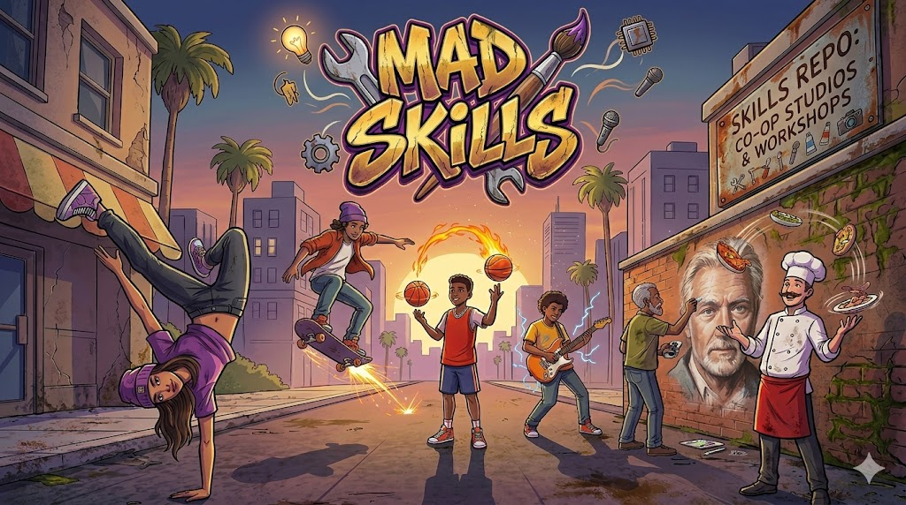
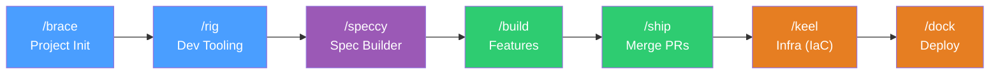

# MAD Skills



A skill framework for Claude Code. Ships 14 skills covering the full development lifecycle — from project initialization to shipping PRs and deploying — with first-class support for both GitHub and Azure DevOps.

## Skills

| Skill | Description | Flags / arguments |
|-------|-------------|-------------------|
| `/brace` | Initialize a project with a standard scaffold: `specs/`, `context/`, a project CLAUDE.md, `.gitignore`, and branch protection. Idempotent. | `--force` |
| `/rig` | Bootstrap a repo with lefthook hooks (including a secret-scan pre-commit check), a commit message template, a PR template, and a CI workflow. Idempotent. | `--skip-system-check` |
| `/prime` | Load project context before significant work. Scans CLAUDE.md, README, specs, docs, and source structure. | `[domain hints]` (comma-separated directories or topics) |
| `/speccy` | Interview-driven specification builder. Reviews code and docs, interviews you in rounds, writes a spec to `specs/`. | `<goal or feature description>` |
| `/build` | Context-isolated feature pipeline. Takes a spec path or plan text and runs explore → architect → implement → review → verify → ship inside subagents. | `<plan or spec path>` `--skip-questions` `--skip-review` `--no-ship` `--parallel-impl` |
| `/ship` | Full PR lifecycle: sync, branch, semantic commits, push, PR, CI watch with auto-fix, squash merge, cleanup. | `--pr-only` `--no-squash` `--keep-branch` |
| `/sync` | Sync with origin/main. Stashes changes, pulls, restores, prunes stale branches and finished worktrees. | `--no-stash` `--no-cleanup` `--no-rebase` |
| `/keel` | Generate Infrastructure as Code pipelines (Terraform, Bicep, Pulumi, CDK). Plans on PR, applies on merge. Provisions what `/dock` deploys to. | `--plan-only` `--skip-interview` `--dry-run` `--tool <terraform\|bicep\|pulumi\|cdk>` |
| `/dock` | Generate container release pipelines. Build once, promote immutable images dev → staging → prod. Azure Container Apps, AWS Fargate, Cloud Run, Kubernetes, Dokku, Coolify, CapRover. | `--registry-only` `--skip-interview` `--dry-run` |
| `/hoist` | Generate low-infrastructure release pipelines that publish directly: npm, PyPI, crates, RubyGems, NuGet, Go, GitHub Releases, static sites, serverless. OIDC/trusted publishing. The non-container sibling of `/dock`. | `--skip-interview` `--dry-run` `--registry <name>` |
| `/distil` | Generate N unique web design variations in a Vite + React + TypeScript + Tailwind project, served at `/1`, `/2`, `/3`. | `<count>` `--port <port>` `--spec <path>` `--favorites <1,2,3>` |
| `/ferry` | Hand a session's live state across a context reset. Writes a waybill and signals the next fresh session to resume from it. | `repo` \| `tmp` \| `commit` (target, default `repo`) |
| `/logbook` | "What's on deck": computed best-practice lifecycle steps plus your committed follow-ups backlog in `LOGBOOK.md`. | `review` \| `archive` \| `resolve <n>` \| `dismiss <n>` \| `restore a<n>` \| `add <text>` |
| `/wright` | Update installed Claude Code marketplace plugins from inside a session, all of them or one by fuzzy name. | `<plugin-name>` `--dry-run` |

## Lifecycle Overview

Each skill produces artifacts that downstream skills consume.


```mermaid
graph LR
    A["/brace<br/>Project Init"] --> B["/rig<br/>Dev Tooling"]
    B --> C["/speccy<br/>Spec Builder"]
    C --> D["/build<br/>Features"]
    D --> E["/ship<br/>Merge PRs"]
    E --> F["/keel<br/>Infra (IaC)"]
    F --> G["/dock<br/>Deploy"]

    style A fill:#4a9eff,color:#fff
    style B fill:#4a9eff,color:#fff
    style C fill:#9b59b6,color:#fff
    style D fill:#2ecc71,color:#fff
    style E fill:#2ecc71,color:#fff
    style F fill:#e67e22,color:#fff
    style G fill:#e67e22,color:#fff
```

| Phase | Skills | What happens |
|-------|--------|--------------|
| **Setup** | `/brace` → `/rig` | Initialize project structure, install hooks, templates, CI workflows |
| **Develop** | `/speccy` → `/build` → `/ship` | Spec features, implement in isolated subagents, merge via the PR lifecycle |
| **Deploy** | `/keel` → `/dock` or `/hoist` | Provision cloud infrastructure, then deploy containers (`/dock`) or publish artifacts directly (`/hoist`) |
| **Utility** | `/sync` · `/prime` · `/ferry` · `/logbook` · `/wright` · `/distil` | Sync with main, load context, hand off across `/clear`, review what's on deck, update plugins, explore web designs |

Skills call each other where it makes sense: `/build` and `/speccy` load context via `/prime`, `/build` ends by invoking `/ship`, `/ship` invokes `/sync` after merging, and `/dock`, `/keel`, and `/rig` sync before scanning. Deterministic stages (sync, CI polling, merge) run as bundled bash scripts; LLM subagents are used only where reasoning is needed (commit and PR authoring, CI fix analysis, code exploration).

For a step-by-step tour of a Node.js app going from an empty folder to a deployed container, see [docs/walkthrough.md](docs/walkthrough.md).

### What Each Skill Generates

| Skill | Key artifacts | Consumed by |
|-------|--------------|-------------|
| `/brace` | `CLAUDE.md`, project skeleton | All other skills |
| `/rig` | `.github/workflows/ci.yml` or `azure-pipelines.yml`, `lefthook.yml`, `.gitmessage`, PR template | `/ship` (CI checks) |
| `/speccy` | `specs/<feature>.md` + pending-build marker | `/build` |
| `/build` | Branch, worktree, draft PR, feature code, tests, `LOGBOOK.md` follow-ups | `/ship` |
| `/ship` | Commits, PR, merged code | CI pipeline, `/dock` triggers |
| `/keel` | `infra/` (IaC), `infra.yml` workflow | `/dock` (infrastructure outputs) |
| `/dock` | `Dockerfile`, `deploy.yml`, `deploy/` config | CI/CD system |
| `/hoist` | Release workflow, publish config | CI/CD (publish) |
| `/sync` | Clean working tree | Any skill (pre-work) |
| `/prime` | Domain context in memory | `/build`, `/speccy` |
| `/distil` | Multiple web design variations | `/build` (chosen design) |
| `/ferry` | `waybill.md` (session state) | A fresh session (resume) |
| `/logbook` | `LOGBOOK.md` (follow-ups backlog) | You (review/resolve) |
| `/wright` | Updated plugin installs | You |

## Session Guard

With the plugin installed, a session-guard hook runs at session start and before each prompt. It checks:

- **Git repository** — not a repo, nested-git, or a git root several levels above the working directory that does not look like a monorepo.
- **CLAUDE.md presence and staleness** — seven weighted signals (file age, directories not mentioned, package and Python dependency drift, config file drift, commits since last update, lock file drift). A score of 3 or more prompts you to refresh it; lower scores are logged silently.
- **Task list and branch state** — surfaced before your first prompt.
- **Lifecycle recommendation** — a `🧭 lifecycle-next` hint computed from repo state (for example, "run `/rig`: no hooks or CI detected"). Dismissible and rate-limited; `/logbook` shows the full picture on demand.
- **Follow-ups** — an open-item count from `LOGBOOK.md`, and a warning if the ledger has uncommitted changes.
- **Ferry waybill** — after `/clear` or a compaction, a pending `/ferry` waybill is auto-loaded so the new session resumes where the last one stopped.

## Platform Support

Skills detect the hosting platform from the git remote and adapt. Both are first-class:

| Capability | GitHub | Azure DevOps |
|-----------|--------|--------------|
| CLI tooling | `gh` | `az devops` (REST API with PAT fallback) |
| CI templates | GitHub Actions | Azure Pipelines |
| Container registry | ghcr.io | Azure Container Registry |
| Secrets | GitHub Secrets | Azure Key Vault |
| PR workflow | `gh pr create/merge` | `az repos pr` / REST |

Platform-aware skills: `/ship`, `/brace`, `/rig`, `/dock`, `/keel`, `/hoist`. The rest are platform-agnostic.

## Works With Superpowers

MAD Skills is the deterministic ops/infra spine: scaffolding, tooling, CI, IaC, container pipelines, session governance, and dual-platform support. Where it overlaps with [Superpowers](https://github.com/obra/superpowers) on methodology (plan → build → finish), it defers to Superpowers when that plugin is installed and falls back to its own pipeline when it is not:

- `/speccy` uses `superpowers:brainstorming` for requirements exploration but still owns the `specs/` artifact.
- `/build` routes its plan and implement stages to `superpowers:executing-plans` / `superpowers:subagent-driven-development`.
- `/ship` hands the final integration to `superpowers:finishing-a-development-branch`.

Superpowers is detected at runtime and never required. Pass `--no-superpowers` to `/speccy`, `/build`, or `/ship` to force the standalone pipeline.

## Installation

| | Plugin | npx skills |
|---|---|---|
| Skills (slash commands) | ✅ all 14 | ✅ all 14 |
| Bundled scripts (sync, CI, merge) | ✅ | ✅ |
| Session hooks (session-guard, ferry, logbook) | ✅ | ❌ |
| Cross-agent (Cursor, Cline, etc.) | ❌ Claude Code only | ✅ |
| Selective skill install | ❌ | ✅ |
| Auto-updates | ✅ | ❌ |

### Plugin (recommended)

Installs skills and session hooks into `~/.claude/plugins/`. Claude Code only.

```bash
claude plugin marketplace add slamb2k/mad-skills   # one-time
claude plugin install mad-skills@slamb2k
```

Or inside Claude Code: `/plugin install mad-skills@slamb2k`. To register the marketplace by hand instead, add to `~/.claude/settings.json`:

```json
"extraKnownMarketplaces": {
  "slamb2k": {
    "source": { "source": "github", "repo": "slamb2k/mad-skills" }
  }
}
```

Update later with `/wright mad-skills`.

### npx skills

```bash
npx skills add slamb2k/mad-skills -g -y              # All skills, global
npx skills add slamb2k/mad-skills --skill ship -g -y  # Specific skill
```

Installs into `~/.claude/skills/` (and `~/.agents/skills/` for other agents). Hooks are **not** installed, so the session guard, ferry auto-load, and logbook hints are inactive. Use this for cross-agent compatibility or selective installs.

> **Dotfiles users:** if `~/.claude/skills/` is a symlink into a dotfiles repo, `npx skills` creates broken relative symlinks. Make `~/.claude/skills/` a real directory and symlink individual custom skills into it with absolute paths instead. `npx skills` leaves entries it did not create untouched.

### npm package

`@slamb2k/mad-skills` on npm is the release artifact published on every merge to main. It has no CLI and is not an install method.

### Upgrading from the old CLI (`npx @slamb2k/mad-skills`, v2.0.x)

```bash
rm -f ~/.claude/commands/{brace,build,distil,prime,rig,ship,sync,speccy}.md
rm -f ~/.claude/.mad-skills-manifest.json
rm -f ~/.claude/skills/*/instructions.md
```

Then install with one of the methods above.

## Repository Structure

See [CLAUDE.md](CLAUDE.md#project-structure) for the maintained tree. In short: `skills/<name>/` holds each skill (`SKILL.md`, `scripts/`, `references/`, `assets/`, `tests/evals.json`), `hooks/` is the session guard, `scripts/` is build and CI tooling, `references/` holds shared contracts, `specs/` holds feature specs from `/speccy`, and `archive/` holds retired skills.

## Development

No build step. Scripts run directly with Node.js (>=18).

```bash
npm run validate          # Structural validation of all skills
npm run lint              # SKILL.md linting
npm run test:unit         # Unit tests: scripts/lib, hooks/lib, packaging, per-skill scripts
npm run eval              # Evals (needs ANTHROPIC_API_KEY or OPENROUTER_API_KEY)
npm run eval:update       # Update eval snapshots
npm run build             # skills/manifest.json + .skill archives
npm test                  # validate + lint + test:unit + eval
```

## CI/CD

One workflow, `.github/workflows/ci.yml`:

- **Pull requests:** validate, lint, and unit tests; evals when enabled, with results posted as a PR comment.
- **Push to main:** after validation passes, the release job bumps the patch version, publishes to npm with provenance, commits the bump with `[skip ci]`, tags, builds `.skill` packages, and creates a GitHub Release.

## Archive

`archive/` holds inactive skills from previous versions, kept for reference only. They are not part of the release, not published, not installed, and not supported.

| Name | Description |
|------|-------------|
| launch | OMC pipeline (hard-dependent on oh-my-claudecode) |
| play-tight | Browser automation (v1.x) |
| pixel-pusher | UI/UX design (v1.x) |
| cyberarian | Document lifecycle management (v1.x) |
| start-right | Repository scaffolding (v1.x) |
| graphite-skill | Git/Graphite workflows (v1.x) |
| example-skill | Scaffold template for new skills |

## License

MIT — see [LICENSE](LICENSE)
