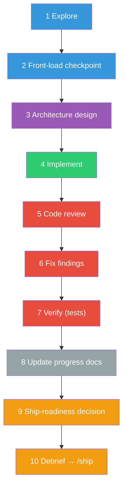
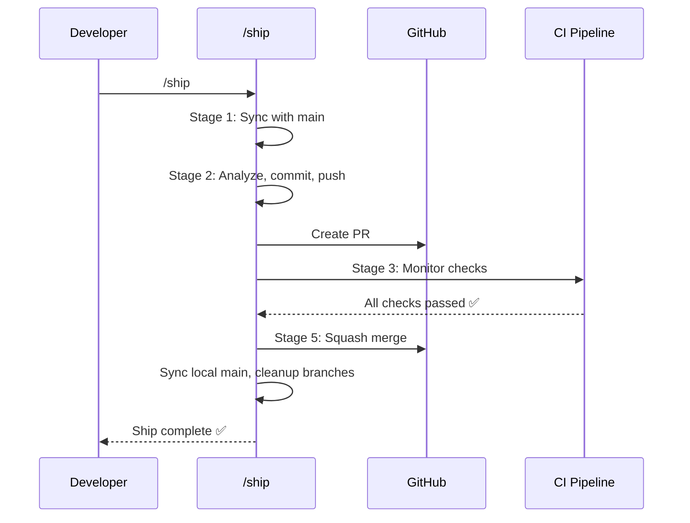
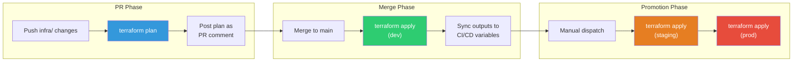
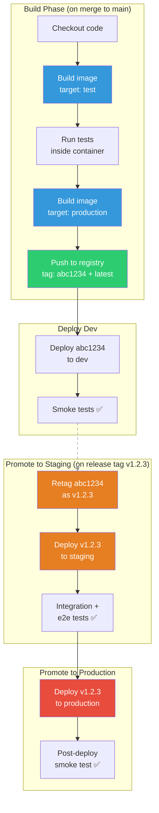
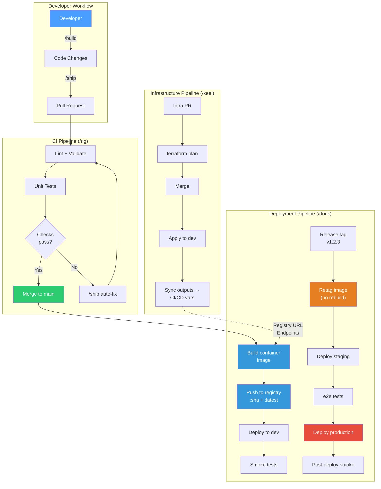

# End-to-End Walkthrough

> Companion to the [README](../README.md). The README has the skill table, flags, and installation; this page shows the skills working together on one project.

This walkthrough follows a Node.js app from an empty folder to a deployed container running on cloud infrastructure.

## Step 0: Session Guard

When you open Claude Code in any project with the mad-skills plugin installed, the **session guard** runs automatically. It validates your development environment before you write a single line of code.

```
[SESSION GUARD] ✅ CLAUDE.md found in: /home/me/my-webapp

[SESSION GUARD] ⚠️  CLAUDE.md appears STALE (score: 4/3)

Signals:
  ⚠ 23 commits since CLAUDE.md updated
  ⚠ Directories not in CLAUDE.md: src/api src/workers
[SESSION GUARD] 🧭 Lifecycle: the next step (/rig) is available.
[SESSION GUARD] 📌 3 open follow-ups — /logbook to review
```

The session guard checks the git repository (including nested-git and monorepo detection), CLAUDE.md presence and staleness (seven weighted signals such as age, directory drift, dependency drift, and commit volume, flagged at a score of 3), the task list, and branch state. It also prints a lifecycle recommendation, an open-follow-ups count from `LOGBOOK.md`, and auto-loads a `/ferry` waybill after `/clear`. Issues are surfaced before your first prompt.

---

## Step 1: `/brace` — Initialize the Project

Start in an empty folder. `/brace` creates the project scaffold.

```
> /brace my-webapp
```

**What it generates:**

```
my-webapp/
├── CLAUDE.md              # AI-readable project instructions
├── .gitignore             # Ignores credentials, data, temp files
├── specs/                 # Specifications (/speccy → /build)
├── context/               # Domain knowledge and references
└── .tmp/                  # Scratch work (gitignored)
```

The CLAUDE.md it creates becomes the foundation — every subsequent skill reads it for project context.

---

## Step 2: `/rig` — Set Up Dev Tooling

With the skeleton in place, `/rig` bootstraps the development infrastructure.

```
> /rig
```

**What it generates:**

```
my-webapp/
├── .github/
│   ├── workflows/ci.yml       # PR validation pipeline (azure-pipelines.yml on Azure DevOps)
│   └── pull_request_template.md
├── lefthook.yml               # Git hooks (lint, test, secret scan on commit)
└── .gitmessage                # Conventional-commit message template
```

`/rig` is idempotent — run it again later and it updates without overwriting your customizations.

---

## Step 3: `/speccy` — Specify What to Build

Before writing code, `/speccy` interviews you to create a detailed specification.

```
> /speccy a user authentication system with OAuth2
```

It asks targeted questions about requirements, edge cases, security concerns, and technical constraints, then produces a structured spec document that `/build` can consume.

---

## Step 4: `/build` — Implement Features

Feed the spec (or any design) to `/build`. It runs the entire development lifecycle inside isolated subagents so your main conversation stays clean.

```
> /build implement the auth system from specs/auth-spec.md
```



Each stage runs in a subagent with its own context; the primary conversation only receives structured reports. `/build` first finds or creates the feature branch, worktree, and draft PR for the spec, so the same `/build specs/auth-spec.md` resumes after an interruption. When Superpowers is installed, the plan and implement stages defer to its methodology skills.

---

## Step 5: `/ship` — Merge via PR

When features are ready, `/ship` handles the entire PR lifecycle.

```
> /ship
```



If CI fails, `/ship` automatically reads the failure logs, fixes the code, pushes a fix commit, and re-monitors — up to 2 attempts before asking for help.

---

## Step 6: `/keel` — Provision Infrastructure

Before deploying, you need infrastructure. `/keel` interviews you about your cloud setup and generates IaC files.

```
> /keel
```

The interview covers: cloud provider, IaC tool, components needed, environments, state management, naming conventions, and resource sizing.

**Example output for Azure + Terraform:**

```
my-webapp/
├── infra/
│   ├── main.tf                  # Provider, backend, module calls
│   ├── variables.tf             # Input variables
│   ├── outputs.tf               # Registry URL, endpoints, connection strings
│   ├── versions.tf              # Required providers
│   ├── bootstrap.sh             # One-time state backend setup
│   ├── sync-outputs.sh          # Sync TF outputs → CI/CD variables
│   ├── environments/
│   │   ├── dev.tfvars
│   │   ├── staging.tfvars
│   │   └── prod.tfvars
│   └── modules/
│       ├── registry/            # Azure Container Registry
│       ├── compute/             # Azure Container Apps
│       ├── database/            # PostgreSQL Flexible Server
│       ├── networking/          # VNet, subnets
│       └── monitoring/          # Log Analytics, App Insights
└── .github/workflows/
    └── infra.yml                # Plan on PR, apply on merge
```

**Infrastructure pipeline flow:**



After `/keel` applies, the infrastructure outputs (registry URL, compute endpoints, database connection strings) are synced as CI/CD variables for `/dock` to consume.

---

## Step 7: `/dock` — Deploy Containers

With infrastructure provisioned, `/dock` creates the release pipeline that builds and deploys your app.

```
> /dock
```

The interview covers: container registry, environments, deployment targets per environment, testing gates, secrets, and rollback strategy.

**Example output:**

```
my-webapp/
├── Dockerfile                   # Multi-stage: deps → build → test → production
├── .dockerignore
├── docker-compose.yml           # Local dev parity
├── deploy/
│   └── environments.yml         # Per-environment config matrix
└── .github/workflows/
    └── deploy.yml               # Build, push, deploy pipeline
```

**The build-once-promote-everywhere pipeline:**



The critical principle: the release tag step **retags** the existing tested image — it never rebuilds. The exact same bytes that passed tests on `main` are what runs in production.

---

## Full Architecture

Here's how all the pipelines connect in the final system:



